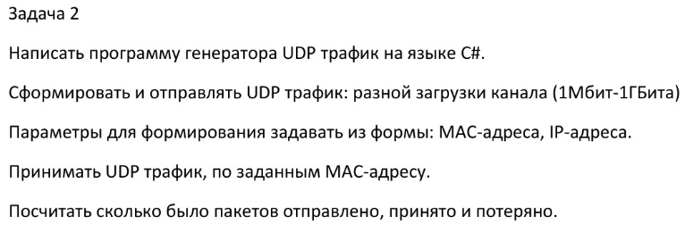

В проекте содержится решение тестовой задачи по разработке приложения для генерации udp трафика.

Для ввода IP и MAC адресов, на которые будут отправляться пакеты, используется форма winforms. winforms часть
разработа с использованием WPF шаблона